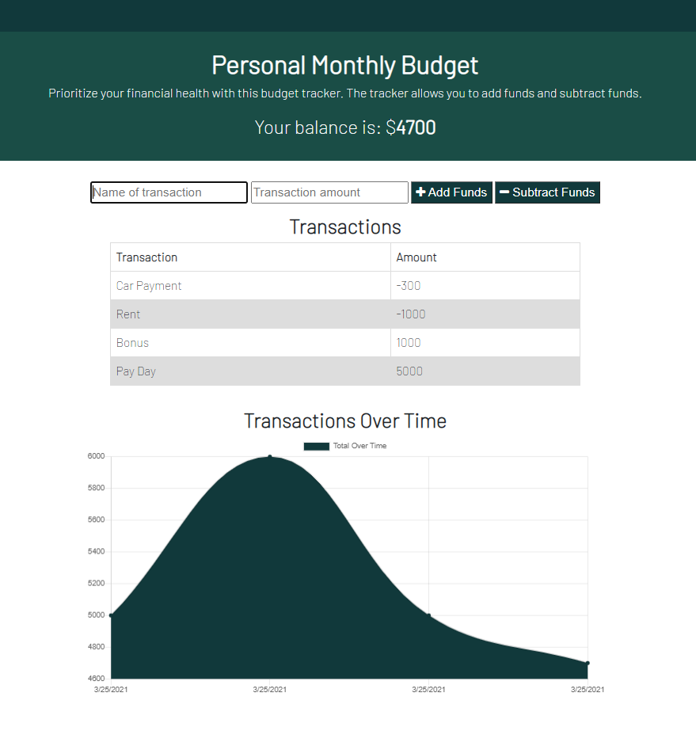
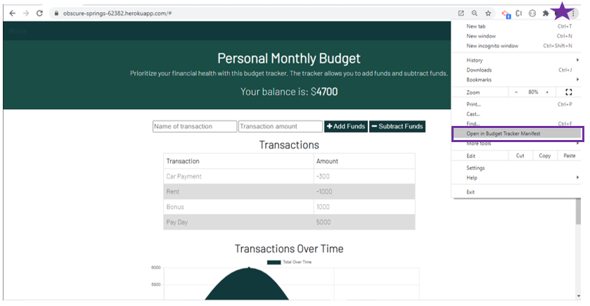

# hw18 Budget-Tracker, 25 MAR 21

#### By Ashley Stith

## Description
This application is a budget tracker that allows offline access and functionality.  Users are able to add expenses and deposits to their budgets whether or not they have internet connection. Deposits are added, expenses are subtracted. Transactions that are entered offlined are populated in the total when the application is re-connected to the internet.  It is a Progressive Web Application (PWA) that includes a webmanifest, service-worker and cached API to be able to work offline.  In addition, the application can be downloaded locally.

## Features
The application utilizes a Mongo database with Mongoose schema.  It handles routes with Express.  The application is deployed with Heroku and MongoDB Atlas.

## Testing
To test the application's functionality:
* Open the deployed link or download the application and open locally.  The necessary files will be pre-cached and a console.log message will confirm they have been pre-cached successfully.
* From the Google Dev Tools, under Application - navigate to the Service Workers tab.
* Click the checkbox next to "Offline" to mimic the application having no connection.
* Add a transaction in the browser window.  You'll notice the transaction is added to the Transactions list and chart as if online.  However, this data is not saved to the database, it is saved to IndexedDb.
* From the Google Dev Tools, Application Tab - click "IndexedDb" -> "budget - https://obscure-springs-62382.herokuapp.com" -> "pendingTransactions"
* Your transaction should be displayed. Note: You may have to refresh the IndexedDb in order to view the pendingTransaction.
* Finally, uncheck the "Offline" Service worker and refresh the page.  Take a look at the pendingTransactions database under IndexedDb.  Your transaction should now be cleared out because its been added to the "real" MongoDb


## Models
The application includes one model: transaction.js that is stored in the models folder.

## Site Images
### Homepage
The homepage displays the budget tracker.  The budget total is included at the top and the transactions are listed and shown on a graph below.  The user is able to add funds and subtract funds


### Download App
The application can be downloaded from Google Chrome by clicking on the Download link


## Dependencies
The application includes the following dependencies:

[Epress NPM package](https://www.npmjs.com/package/express)

[Mongoose](https://mongoosejs.com/)

[Morgan](https://www.npmjs.com/package/morgan)

[Compression NPM package](https://www.npmjs.com/package/compression)

[Lite-Server NPM package](https://www.npmjs.com/package/lite-server)

The application is invoked locally by using the following command:

```bash
npm start
```

## Installation
* Install node.js to computer, if not already present.

    * Node.js can be installed from [here](https://nodejs.org/en/).

* Copy all the application files locally to one's machine.

* In a terminal window where you copied the files, install all dependencies. These installations are accomplished by performing the following command:

```bash
npm i
```

## Known Bugs
* There may be "fetch" warnings that display when the application is launched. They do not affect the functionality of the application. They will be addressed in a future release.

## Technologies Used
* node.js
* MongoDb
* Mongoose
* Express
* Compression
* Lite-Server

## Contact
Please email [Ashley Stith](mailto:ashleyc.stith@gmail.com) with questions or for additional inforamtion.

## Contribution Guidelines
Direct link to repository: https://github.com/stithac/budget-tracker

## Deployment
The site is deployed to heroku: https://obscure-springs-62382.herokuapp.com/
